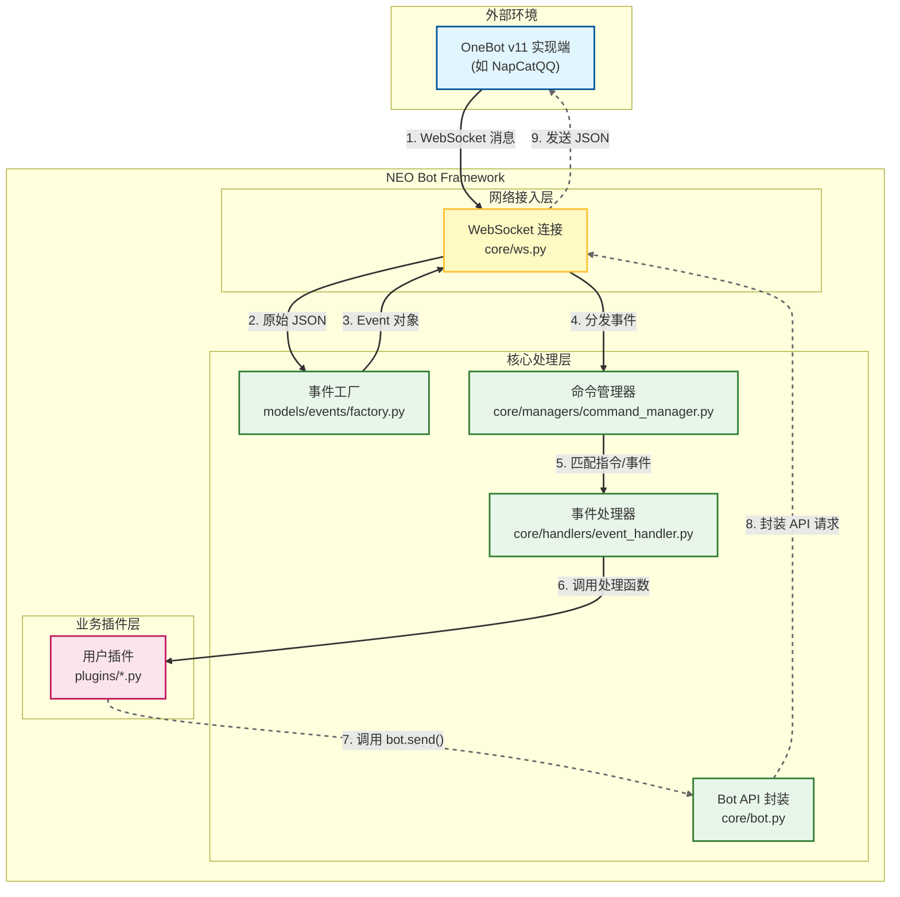

# 核心概念：事件流转

NEO Bot 的核心就是**事件驱动**。搞懂一个事件从哪来、到哪去，你就懂了一大半。

下面就拿 `/echo hello` 举例

## 事件流转图

## 详细步骤

### 1. 接收 WebSocket 消息 (`core/ws.py`)

*   你在群里发了条消息，OneBot (比如 NapCatQQ) 就会把它打包成一个 JSON，通过 WebSocket 扔给 Bot。
*   `core/ws.py` 里的 `_listen_loop` 一直在那蹲着，收到这个 JSON 字符串。

### 2. 变成对象 (`models/events/factory.py`)

*   `ws.py` 拿到 JSON 后，扔给 `EventFactory.create_event()`。
*   工厂类看一眼 `post_type` 是 `"message"`，`message_type` 是 `"group"`，会包装成 `GroupMessageEvent` 对象。
*   这时候已经是 Python 对象了，有属性有方法，可以直接调用。

### 3. 塞点东西，准备分发 (`core/ws.py`)

*   `ws.py` 拿到这个对象后，干两件事：
    1.  **塞 Bot 实例**：把 `self.bot` 塞进 `event.bot` 里。这样你在插件里拿到事件，就能直接 `event.reply()` 回复，不用到处找 Bot 实例。
    2.  **扔出去**：把事件扔给 `matcher.handle_event(bot, event)`，也就是命令管理器。

### 4. 找找谁来处理 (`core/managers/command_manager.py`)

*   `CommandManager` (就是代码里的 `matcher`)
*   它看了一眼，然后转手交给 `MessageHandler`。
*   `MessageHandler` 看消息内容是以 `/` 开头的吗？
*   如果是 `/echo`，已经注册的指令列表，找到了 `plugins/echo.py` 里那个被 `@matcher.command("echo")` 标记的函数。

### 5. 干活 (`plugins/echo.py`)

*   直接调用它，把 `Event` 对象和参数 `args` 传进去。
*   这时候就是你写的代码在跑了。

### 6. 回复消息 (`core/bot.py` -> `core/ws.py`)

*   你在插件里写了 `await event.reply("hello")`。
*   这行代码背后，是 `core/bot.py` 把你的话封装成了一个标准的 OneBot API 请求（`send_group_msg`）。
*   然后 `core/ws.py` 把这个请求变成 JSON，通过 WebSocket 扔回给 OneBot。

### 7. 发送成功

*   OneBot 收到请求，把 "hello" 发到了群里。

至此，一个完整的事件流转闭环就完成了。理解这个流程后，您就能明白框架是如何为开发者提供便捷接口的。
